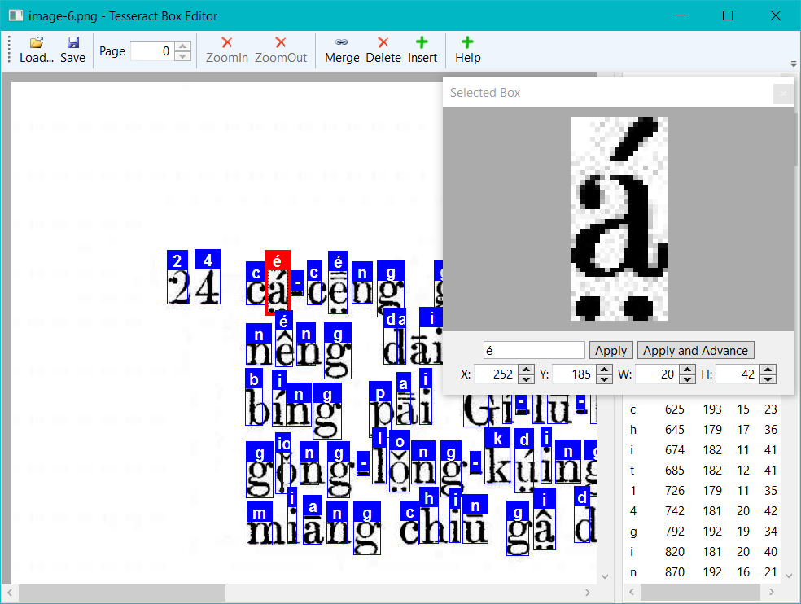

# tesseract-box-editor
A box file editor for Tesseract OCR 3.0x

## Requirements
 -  Microsoft .Net Framework 4.0
 
## Features
 - Supports Multi-Page tiff files
 - Rubber-band selection of boxes
 - Ctrl+Click multi-selection of boxes
 - Apply value to all selections
 - Apply and advance to next box via Enter key for fast input
 - Zoom view of selected box
 - Ctrl+Rubber-band creation of new box
 - Merge boxes
 - Adjust box location with Arrow keys
 - Adjust box size with Shift+Arrow keys

## Acknowledgement

This repo is a fork of [*tesseract-box-editor* by scotts48](https://github.com/scotts48/tesseract-box-editor).

tesseract-box-editor was originally hosted on Google Code: 
https://code.google.com/archive/p/tesseract-box-editor/